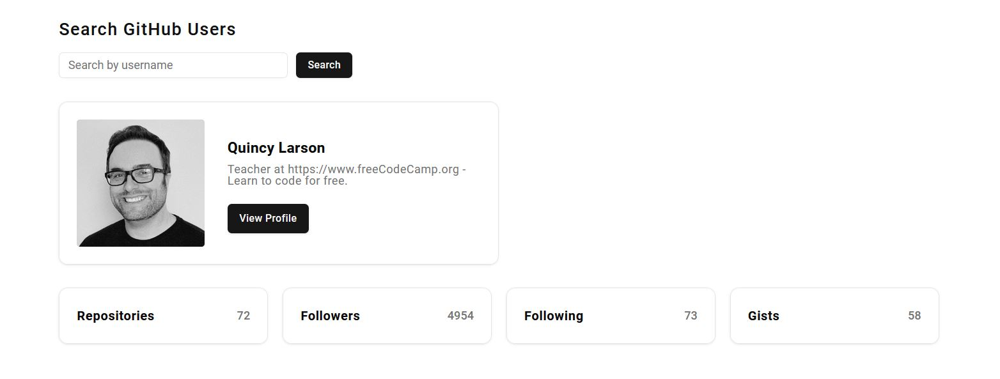
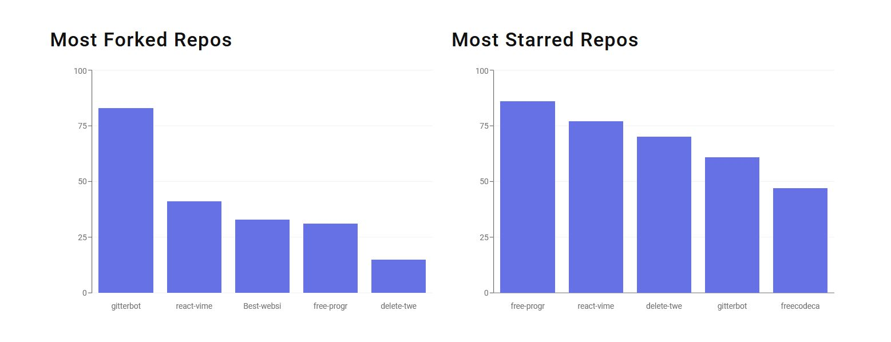

## GraphQL - Search GitHub users project

**Project URL:**
https://graphql-search-github-users-project.netlify.app/

**Key Features:**

- GraphQL query setup with Apollo Client.
- Use of query result to display user details, image and profile stats. 
- Use of query result to display bar charts (Most Forked Repos, Most Starred Repos and Popular Languages).

